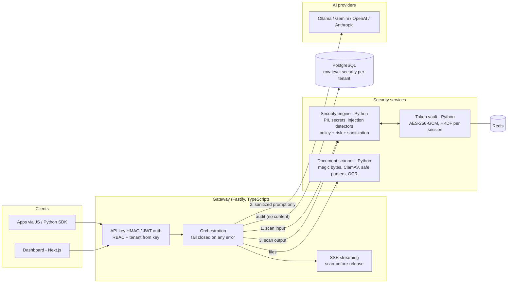

# SentinelAI — Security Gateway for Enterprise AI

[](https://github.com/yourmemecommunity-sy/SentinelAI/actions/workflows/ci.yml)

**The problem.** Employees and applications paste customer data, credentials and confidential documents into AI models every day.
Once a prompt leaves the company, that data is outside its control. Existing controls either block AI entirely or trust every prompt.

**What SentinelAI does.** It sits between applications and AI models (Gemini, OpenAI, Anthropic, Ollama). Every prompt, file and
model reply is scanned, then allowed, masked, tokenized or blocked by per-tenant policy, and audited, *before* anything sensitive
reaches a model. If any security component is unavailable, the request is refused, never passed through unscanned.

The project lives in [`sentinel-ai/`](sentinel-ai/); this page mirrors [`sentinel-ai/README.md`](sentinel-ai/README.md).

## Architecture



## What is verified for real

Every row below was executed on real infrastructure, not mocks. The evidence (commands and output) is in
[`sentinel-ai/docs/verification/`](sentinel-ai/docs/verification/).

| Claim | Verified against | Evidence |
|---|---|---|
| 1,119 automated tests, 0 failing (TypeScript, Python, SDKs, dashboard) | host run, plus CI under `act` (8/8 jobs) | [01](sentinel-ai/docs/verification/01-baseline.md), [07](sentinel-ai/docs/verification/07-ci.md) |
| Full stack in Docker: 10 services healthy, 81 container checks (isolation, fail-closed, persistence, streaming) | Docker Engine, all 7 images built | [02](sentinel-ai/docs/verification/02-docker.md) |
| Tenant isolation enforced by the database (40 isolation tests, migrations 0001–0008) | real PostgreSQL 18.6 | [03](sentinel-ai/docs/verification/03-postgresql.md) |
| Token vault: TTL eviction, circuit breaker opens on a frozen server and recovers | real Redis 8.0 / 7.4 | [04](sentinel-ai/docs/verification/04-redis.md) |
| EICAR blocked by real antivirus; email in a screenshot OCR'd and masked | real ClamAV 1.5.4, Tesseract 5.5 | [05](sentinel-ai/docs/verification/05-clamav-tesseract.md) |
| The model receives `j***@example.com`, never the address; a prompt with a secret never reaches the model | real Ollama (`qwen2:0.5b`), with a recording proxy | [06](sentinel-ai/docs/verification/06-real-provider.md) |
| No fixable HIGH/CRITICAL CVEs in any image; no secret in the tree | Trivy, gitleaks, pnpm audit, pip-audit | [07](sentinel-ai/docs/verification/07-ci.md) |

## Numbers

**Independent security evaluation**: public datasets the rules were never tuned on; held-out test splits
([details](sentinel-ai/docs/verification/08-independent-evaluation.md)).

| Dataset | Detection rate | False-positive rate |
|---|---|---|
| deepset/prompt-injections (EN + DE) | **1.7 %** | 0.0 % |
| jackhhao/jailbreak-classification | **39.6 %** | 0.0 % |
| Own synthetic suite (524 records, self-authored) | 100 % of critical cases | ≤ 2 % budget, met |

In short, the filter is precise but has low recall against attacks written by other people. The self-authored suite
overstates real-world coverage. Improving recall (an ML classifier) is the next milestone.

**Gateway overhead** — measured with k6 against the Docker stack and an instant mock model, so only gateway + security
engine + audit cost is counted ([details](sentinel-ai/docs/verification/09-performance.md)):

| Measure (one laptop: i5-13420H, 12 vCPU WSL2 VM; load generator on the same machine) | Result |
|---|---|
| Latency added to a chat request, 1 in flight (input scan + policy + output scan + audit) | **p50 42 ms · p95 56 ms · p99 84 ms** |
| Standalone scan, 1 in flight | p50 23 ms · p95 32 ms · p99 53 ms |
| Throughput at saturation, single instance | ≈ 44–68 chat req/s · ≈ 128 scan req/s |

These are single-instance numbers with 0 failed requests. Past ~8 concurrent requests extra load only adds queueing, and
run-to-run variance on a shared laptop is tens of percent.

## Quick start

Requires Docker (on Windows: Docker Engine in WSL2 or Docker Desktop).

```bash
cd sentinel-ai
bash scripts/development/docker-secrets.sh && docker compose up -d && bash scripts/development/docker-up.sh
```

This gives the gateway on `http://127.0.0.1:4000` and the dashboard on `http://127.0.0.1:3000`. Sign up in the dashboard,
create an API key, then:

```bash
curl -s http://127.0.0.1:4000/v1/security/scan -H "x-sentinel-api-key: $KEY" -H "content-type: application/json" \
     -d '{"text":"Please email jane.doe@example.com"}'
# -> "decision":"MASK", "sanitized_text":"Please email j***@example.com"
```

To use a local model, run `docker compose --profile ollama up -d` and set `OLLAMA_BASE_URL`/`OLLAMA_MODEL` in `sentinel-ai/.env`.
To check the whole stack (from `sentinel-ai/`): `bash scripts/development/docker-verify.sh`.

## Known limitations (stated plainly)

* **Detection recall on third-party prompt-injection and jailbreak prompts is low** (see the numbers above). The detectors are
  rules, not ML; German and plain-language goal hijacking are mostly missed.
* **Gemini, OpenAI and Anthropic have never been called for real**: no API keys were available. Those adapters are tested
  against stand-in servers only. Ollama is verified for real.
* **CI on GitHub-hosted runners**: see the badge above. Locally, all 8 jobs passed under `act`; the `containers` job's
  steps were run directly.
* **Rate limiting is per gateway instance.** With N replicas a client gets N× the limit; the shared Redis limiter is designed
  but not built ([why](sentinel-ai/docs/LEARNING.md#7-rate-limiting-per-instance-today-and-the-fix)).
* Runs on one machine only: no managed-cloud deployment, no multi-node Kubernetes (Helm verified on a single-node `kind`
  cluster), and no soak test. Benchmarks share one laptop CPU with the load generator.
* No SSO/MFA, and no ML/NER detection layer (roadmap phases 3–4).

Full status: [sentinel-ai/docs/architecture/roadmap.md](sentinel-ai/docs/architecture/roadmap.md) · design decisions explained:
[sentinel-ai/docs/LEARNING.md](sentinel-ai/docs/LEARNING.md) · decisions taken during verification: [sentinel-ai/docs/decisions-log.md](sentinel-ai/docs/decisions-log.md).

## Layout

| Path | Responsibility |
|---|---|
| `sentinel-ai/apps/api` | Node/TS API gateway: auth, tenancy, orchestration, streaming |
| `sentinel-ai/apps/dashboard` | Next.js dashboard (BFF with httpOnly cookies, CSRF, nonce CSP) |
| `sentinel-ai/services/security-engine` | Python detectors, sanitization, risk, policy, pipeline |
| `sentinel-ai/services/token-vault` | Python reversible tokenization (Redis, AES-256-GCM) |
| `sentinel-ai/services/document-scanner` | Python file validation, malware scan, extraction, OCR |
| `sentinel-ai/services/ai-router` | TS provider adapters (compiled into the gateway) |
| `sentinel-ai/services/policy-engine` | Python policy evaluation service |
| `sentinel-ai/packages/*` | Shared types, JS and Python SDKs |
| `sentinel-ai/datasets/` | Synthetic, versioned security datasets (no real data, ever) |
| `sentinel-ai/{tests,docs,scripts,infrastructure}/` | Cross-service tests, documentation, tooling, Helm/Terraform |

`node scripts/development/validate-structure.mjs` (run inside `sentinel-ai/`) enforces the layout rules. CI fails if it
fails. The CI workflow is at [`.github/workflows/ci.yml`](.github/workflows/ci.yml), at the repository root.
