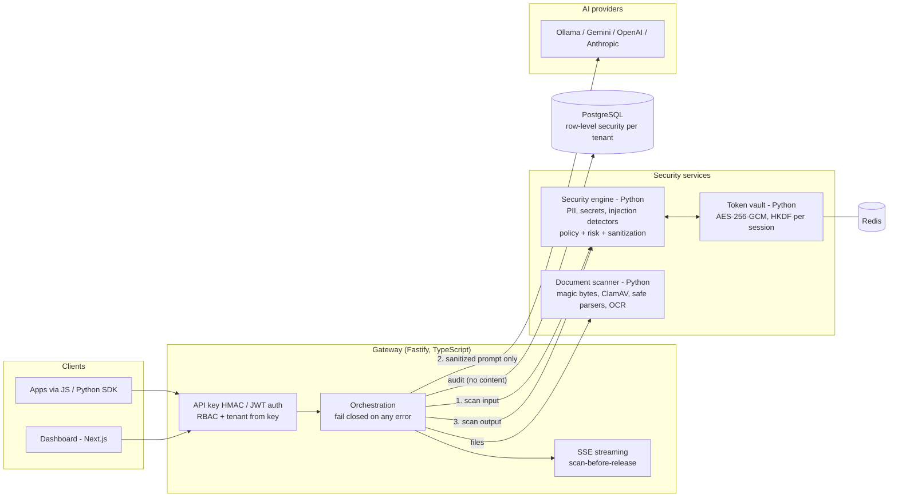
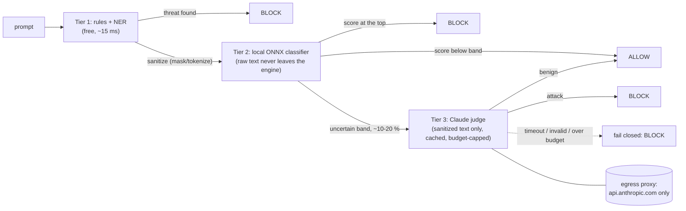

# SentinelAI — Security Gateway for Enterprise AI

[](https://github.com/yourmemecommunity-sy/SentinelAI/actions/workflows/ci.yml)

> **📽️ DEMO PLACEHOLDER — demo GIF and screenshots go here.** Put the files in [`sentinel-ai/docs/media/`](sentinel-ai/docs/media/) and replace this
> block, for example with `` and ``.
<!-- MEDIA-PLACEHOLDER: owner adds sentinel-ai/docs/media/demo.gif + screenshots, then deletes this comment and the block above. -->

**The problem.** Employees and applications paste customer data, credentials and confidential documents into AI models every day.
Once a prompt leaves the company, that data is outside its control. Existing controls either block AI entirely or trust every prompt.

**What SentinelAI does.** It sits between applications and AI models (Gemini, OpenAI, Anthropic, Ollama). Every prompt, file and
model reply is scanned, then allowed, masked, tokenized or blocked by per-tenant policy, and audited, *before* anything sensitive
reaches a model. If any security component is unavailable, the request is refused, never passed through unscanned.

The project lives in [`sentinel-ai/`](sentinel-ai/); this page mirrors [`sentinel-ai/README.md`](sentinel-ai/README.md).

**Tech stack:** TypeScript (Node.js 20, Fastify, Zod, jose, pg) · Next.js + React + Tailwind CSS · Python 3.12 (FastAPI,
Pydantic, spaCy NER, ONNX Runtime, Anthropic SDK, cryptography, redis-py, pypdf, defusedxml) · PostgreSQL 18 · Redis · ClamAV · Tesseract · Docker Compose · Helm ·
Terraform · GitHub Actions · Vitest · pytest · mypy · Playwright · k6

## Architecture



## What is verified for real

Every row below was executed on real infrastructure, not mocks. The evidence (commands and output) is in
[`sentinel-ai/docs/verification/`](sentinel-ai/docs/verification/).

| Claim | Verified against | Evidence |
|---|---|---|
| 1,119 automated tests, 0 failing (TypeScript, Python, SDKs, dashboard) | host run; **GitHub Actions: runs #1 and #2 green, all 9 jobs** | [01](sentinel-ai/docs/verification/01-baseline.md), [07](sentinel-ai/docs/verification/07-ci.md) |
| Full stack in Docker: 10 services healthy, 81 container checks (isolation, fail-closed, persistence, streaming) | Docker Engine, all 7 images built | [02](sentinel-ai/docs/verification/02-docker.md) |
| Tenant isolation enforced by the database (40 isolation tests, migrations 0001–0008) | real PostgreSQL 18.6 | [03](sentinel-ai/docs/verification/03-postgresql.md) |
| Token vault: TTL eviction, circuit breaker opens on a frozen server and recovers | real Redis 8.0 / 7.4 | [04](sentinel-ai/docs/verification/04-redis.md) |
| EICAR blocked by real antivirus; email in a screenshot OCR'd and masked | real ClamAV 1.5.4, Tesseract 5.5 | [05](sentinel-ai/docs/verification/05-clamav-tesseract.md) |
| The model receives `j***@example.com`, never the address; a prompt with a secret never reaches the model | real Ollama (`qwen2:0.5b`), with a recording proxy | [06](sentinel-ai/docs/verification/06-real-provider.md) |
| No fixable HIGH/CRITICAL CVEs in any image; no secret in the tree | Trivy, gitleaks, pnpm audit, pip-audit | [07](sentinel-ai/docs/verification/07-ci.md) |
| v2 cascade: a pinned local classifier blocks injections in the running stack; `/ready` proves it loads and works; the engine can reach only the AI judge's API (other hosts refused, a library's telemetry call blocked) | Docker stack, ONNX Runtime, allow-list egress proxy; 77 container checks | [12](sentinel-ai/docs/verification/12-ai-vs-ai.md) |
| v2 explanations, replay, red-team rounds stored and shown (migration 0009, RLS) | PostgreSQL in the stack + PGlite suites; live red-team rounds against the gateway | [12](sentinel-ai/docs/verification/12-ai-vs-ai.md) |
| **Not verified:** the Claude judge and Claude red-team generator (no API key; built and tested against fakes only) | — | [12](sentinel-ai/docs/verification/12-ai-vs-ai.md#7-blockers-and-what-the-owner-must-do) |

## Numbers

All detection numbers come from **public datasets the rules were never tuned on**, using held-out data. They are reported
as measured, even where they are poor.

### 1. Data leakage: PII and secrets

**PII**: [ai4privacy](https://huggingface.co/ai4privacy) PII-masking datasets, English **validation** splits (17,046 + 7,946
records), held out: one improvement cycle was tuned on the *train* splits only, then measured here once. Detection rate
means the right detector fired on the labelled span ([before](sentinel-ai/docs/verification/10-pii-secrets-evaluation.md) ·
[after the NER cycle](sentinel-ai/docs/verification/11-pii-improvement-cycle.md)).

| PII type | Detection rate, 400k / 300k: before → **after** | False-positive rate of the detector (400k / 300k), after |
|---|---|---|
| **Records containing PII that pass unchanged (ALLOW)** | 67.8 % / 47.1 % → **47.2 % / 32.9 %** | — |
| Person names (NER) | 0 % → **48–50 % / 34–40 %** | 36 % / 17 % (upper bound: the data leaves many names unlabelled) |
| Cities / countries (NER; reported, allowed by default) | 0 % → **46 % / 32–51 %** | 57 % / 21 % (upper bound) |
| Email | 99.3 % / 98.5 % → **99.3 % / 99.0 %** | 0.0 % / 3.1 % |
| Phone number | 62.7 % / 63.0 % → **62.7 % / 63.4 %** | 5.0 % / 3.5 % |
| Social-security number | 35.5 % / 29.9 % → **57.4 % / 64.6 %** | 0.2 % / 0.7 % |
| Date of birth | 19.9 % / 24.8 % → **41.7 % / 65.0 %** | 2.7 % / 1.8 % |
| Credit card | 11.6 % → 9.9 % (400k; only 10 % of its "cards" are valid numbers) | **82.9 % → 58.3 %** (IMEI false hits −80 %) |
| Driver's licence · password · passport | 31 % / 56 % · 9 % / 40 % · — / 3 % (unchanged) | ≤ 5 % |
| Usernames, IP addresses, street numbers, postcodes | ≈ 0 % (no detector) | — |

**Secrets**: [Samsung CredData](https://github.com/Samsung/CredData), human-labelled credential candidates from public
repositories:

| Secret type (67,564 labelled lines) | Detection rate | False-positive rate (on hard negatives) |
|---|---|---|
| **All credentials** | **44.8 %** of 15,714 | **14.2 %** of 51,847 |
| Private keys (PEM), JSON Web Tokens | **100 %** | 85 % / 84 % (example keys and tokens are blocked too, by design) |
| HTTP Basic / Bearer credentials | 87 % / 78 % | 0.5 % / — |
| Generic keys · tokens · passwords | 42 % · 46 % · 58 % | 6.0 % · 2.0 % · 27.8 % |
| UUIDs used as secrets · generic secrets | 6 % · 26 % | 59 % · 8 % |

Overall, well-formatted values (email, private keys, JWTs, auth headers, prefixed vendor keys) are caught. The NER layer now
finds about half of all person names. Addresses, usernames and secrets that look like ordinary values (UUIDs, salts,
generic passwords) mostly are not caught. **33–47 % of records that contain PII still pass through with decision ALLOW**
(down from 47–68 %). The Indian identifiers (Aadhaar, PAN, UPI) do not appear in these datasets, so they are covered only by
the self-authored suite.

### 2. Prompt injection and jailbreak

Held-out test splits, AI judge off ([rules](sentinel-ai/docs/verification/08-independent-evaluation.md),
[cascade](sentinel-ai/docs/verification/12-ai-vs-ai.md)):

| Dataset | Rules only | **Rules + local classifier (current)** | False-positive rate (current) |
|---|---|---|---|
| deepset/prompt-injections (EN + DE; the classifier never saw it) | 1.7 % | **13.3 %** | 0.0 % |
| jackhhao/jailbreak-classification (the classifier was trained on it: optimistic) | 39.6 % | **61.2 %** | 0.0 % |

The classifier's thresholds keep false blocks on ordinary business text at 0.7–2.3 %. A looser threshold reached 43 % on
deepset but blocked 39–54 % of business text, so it was rejected ([why](#ai-vs-ai)). The self-authored suite (524 records,
100 % of critical cases) overstates real-world coverage.

### 3. Performance

Measured with k6 against the Docker stack and an instant mock model, so only gateway + security engine + audit cost is
counted. Before and after the NER layer were measured on the same machine and day
([details](sentinel-ai/docs/verification/11-pii-improvement-cycle.md#performance-cost-of-the-ner-layer)):

| Measure (one laptop: i5-13420H, 12 vCPU WSL2 VM; load generator on the same machine) | Before NER | **With NER (current)** |
|---|---|---|
| Latency added to a chat request, 1 in flight (p50 · p95 · p99) | 45 · 56 · 74 ms | **55 · 69 · 87 ms** |
| Same, chat containing PII (masking path) | 41 · 57 · 68 ms | **62 · 75 · 104 ms** |
| Standalone scan, 1 in flight (p50 · p95 · p99) | 21 · 28 · 37 ms | **29 · 36 · 50 ms** |
| Throughput at saturation, single engine process | ≈ 66–78 chat · ≈ 141–150 scan req/s | **≈ 16–23 chat · ≈ 43–44 scan req/s** |

Per request, NER costs 10–36 ms. Under load, throughput fell by about 70 % because NER is CPU-bound; **configurable engine
workers now recover most of it** (53 → 89 scans/s with 2 workers, rules + NER). The local classifier adds ~50 ms per request
and costs about two thirds of scan throughput (17.6 → 25.8 scans/s with 1 → 2 workers, ~1.2 GiB memory per worker)
([details](sentinel-ai/docs/verification/12-ai-vs-ai.md)). All numbers are single-instance, with 0 failed requests; run-to-run variance
on a shared laptop is tens of percent.

## AI vs AI

**Defence: a detection cascade.** Cheap, deterministic checks decide first; models are consulted only when they are unsure,
and they can only add a block, never remove one ([ADR-0007](sentinel-ai/docs/architecture/adr/0007-additive-ml-and-llm-judge.md)).



* **Explainable and replayable.** Every decision records which tier decided, the detectors and scores, the policy version and
  every component version, plus a keyed hash of the input (never the input). Given the original text,
  `POST /v1/events/{id}/replay` re-runs the decision with the recorded policy and verdict and shows whether it is identical.
  The dashboard event page answers "why was this blocked?".
* **Attack: an AI red team.** `scripts/security/red_team.py` generates new attacks (direct and indirect injection,
  obfuscation, role-play jailbreaks, data exfiltration, Hindi/Hinglish), fires them at the local gateway, scores each by tier
  and keeps what got through as a versioned regression set. Dashboard → **Red team** shows rounds and trends. One command:
  `bash scripts/demo/ai-vs-ai.sh`.

**Numbers** ([evidence](sentinel-ai/docs/verification/12-ai-vs-ai.md)):

| | Result |
|---|---|
| Independent injection set (deepset, held out) | rules 1.7 % → **cascade 13.3 %** detected, 0 % false positives (judge off) |
| Benign business text with PII (ai4privacy, held out) | **0.7–2.3 %** falsely blocked as injection (a benchmark-tuned threshold blocked 39–54 %) |
| Red team, offline seed generator, 48 attacks | 4.2 % got through (loose threshold) · **39.6 %** (current threshold) |
| Judge cost (worst case, measured call rates) | ~**USD 0.33 per 1,000 requests** with the judge on, 0 off; hard cap USD 5 |
| AI spend in this verification | **USD 0.00**: no Anthropic key was available |

**Limitations.** The Claude judge and the Claude red-team generator are **built and tested but have never run live** (no
key): every judge number above is "judge off", and both red-team rounds used a self-authored, non-AI seed generator that is
biased towards what the detectors already catch. The classifier must be very conservative on its own to avoid blocking
business text, so most of the remaining recall depends on the judge. Long inputs are only partly classified (the start and
end), and can fail closed on timeouts under load.

## Quick start

Requires Docker (on Windows: Docker Engine in WSL2 or Docker Desktop).

```bash
cd sentinel-ai
bash scripts/development/docker-secrets.sh && docker compose up -d && bash scripts/development/docker-up.sh
```

This gives the gateway on `http://127.0.0.1:4000` and the dashboard on `http://127.0.0.1:3000`. Sign up in the dashboard,
create an API key, then:

```bash
curl -s http://127.0.0.1:4000/v1/security/scan -H "x-sentinel-api-key: $KEY" -H "content-type: application/json" \
     -d '{"text":"Please email jane.doe@example.com"}'
# -> "decision":"MASK", "sanitized_text":"Please email j***@example.com"
```

To use a local model, run `docker compose --profile ollama up -d` and set `OLLAMA_BASE_URL`/`OLLAMA_MODEL` in `sentinel-ai/.env`.
To check the whole stack (from `sentinel-ai/`): `bash scripts/development/docker-verify.sh`.

## Known limitations (stated plainly)

* **Detection recall is still limited** (see the numbers above). The NER layer finds about half of all names. Addresses,
  usernames and IDs are mostly missed, and 33–47 % of PII-bearing records in the public PII sets still pass unchanged. Most
  third-party prompt injections are still missed (13.3 % caught with the AI judge off; see [AI vs AI](#ai-vs-ai)).
* **Models cost throughput and memory**: NER and the classifier are CPU-bound; more engine workers help, but each needs
  ~1.2 GiB (see Performance).
* **The AI judge has never been run live** (no Anthropic key): its accuracy, latency and real cost are unmeasured.
* **Gemini, OpenAI and Anthropic have never been called for real**: no API keys were available. Those adapters are tested
  against stand-in servers only. Ollama is verified for real.
* **Rate limiting is per gateway instance.** With N replicas a client gets N× the limit; the shared Redis limiter is designed
  but not built ([why](sentinel-ai/docs/LEARNING.md#7-rate-limiting-per-instance-today-and-the-fix)).
* Runs on one machine only: no managed-cloud deployment, no multi-node Kubernetes (Helm verified on a single-node `kind`
  cluster), and no soak test. Benchmarks share one laptop CPU with the load generator.
* No SSO/MFA (roadmap phase 4).

Full status: [sentinel-ai/docs/architecture/roadmap.md](sentinel-ai/docs/architecture/roadmap.md) · design decisions explained:
[sentinel-ai/docs/LEARNING.md](sentinel-ai/docs/LEARNING.md) · decisions taken during verification: [sentinel-ai/docs/decisions-log.md](sentinel-ai/docs/decisions-log.md).

## Layout

| Path | Responsibility |
|---|---|
| `sentinel-ai/apps/api` | Node/TS API gateway: auth, tenancy, orchestration, streaming |
| `sentinel-ai/apps/dashboard` | Next.js dashboard (BFF with httpOnly cookies, CSRF, nonce CSP) |
| `sentinel-ai/services/security-engine` | Python detectors, sanitization, risk, policy, pipeline |
| `sentinel-ai/services/token-vault` | Python reversible tokenization (Redis, AES-256-GCM) |
| `sentinel-ai/services/document-scanner` | Python file validation, malware scan, extraction, OCR |
| `sentinel-ai/services/ai-router` | TS provider adapters (compiled into the gateway) |
| `sentinel-ai/services/policy-engine` | Python policy evaluation service |
| `sentinel-ai/packages/*` | Shared types, JS and Python SDKs |
| `sentinel-ai/datasets/` | Synthetic, versioned security datasets (no real data, ever) |
| `sentinel-ai/{tests,docs,scripts,infrastructure}/` | Cross-service tests, documentation, tooling, Helm/Terraform |

`node scripts/development/validate-structure.mjs` (run inside `sentinel-ai/`) enforces the layout rules. CI fails if it
fails. The CI workflow is at [`.github/workflows/ci.yml`](.github/workflows/ci.yml), at the repository root.
