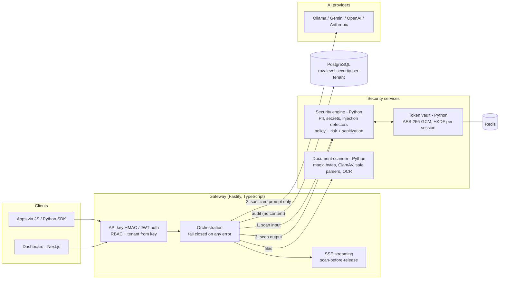

# SentinelAI — Security Gateway for Enterprise AI

[](https://github.com/yourmemecommunity-sy/SentinelAI/actions/workflows/ci.yml)

> **📽️ DEMO PLACEHOLDER — demo GIF and screenshots go here.** Put the files in [`docs/media/`](docs/media/) and replace this
> block, for example with `` and ``.
<!-- MEDIA-PLACEHOLDER: owner adds docs/media/demo.gif + screenshots, then deletes this comment and the block above. -->

**The problem.** Employees and applications paste customer data, credentials and confidential documents into AI models every day.
Once a prompt leaves the company, that data is outside its control. Existing controls either block AI entirely or trust every prompt.

**What SentinelAI does.** It sits between applications and AI models (Gemini, OpenAI, Anthropic, Ollama). Every prompt, file and
model reply is scanned, then allowed, masked, tokenized or blocked by per-tenant policy, and audited, *before* anything sensitive
reaches a model. If any security component is unavailable, the request is refused, never passed through unscanned.

**Tech stack:** TypeScript (Node.js 20, Fastify, Zod, jose, pg) · Next.js + React + Tailwind CSS · Python 3.12 (FastAPI,
Pydantic, cryptography, redis-py, pypdf, defusedxml) · PostgreSQL 18 · Redis · ClamAV · Tesseract · Docker Compose · Helm ·
Terraform · GitHub Actions · Vitest · pytest · mypy · Playwright · k6

## Architecture



## What is verified for real

Every row below was executed on real infrastructure, not mocks. The evidence (commands and output) is in
[`docs/verification/`](docs/verification/).

| Claim | Verified against | Evidence |
|---|---|---|
| 1,119 automated tests, 0 failing (TypeScript, Python, SDKs, dashboard) | host run; **GitHub Actions: runs #1 and #2 green, all 9 jobs** | [01](docs/verification/01-baseline.md), [07](docs/verification/07-ci.md) |
| Full stack in Docker: 10 services healthy, 81 container checks (isolation, fail-closed, persistence, streaming) | Docker Engine, all 7 images built | [02](docs/verification/02-docker.md) |
| Tenant isolation enforced by the database (40 isolation tests, migrations 0001–0008) | real PostgreSQL 18.6 | [03](docs/verification/03-postgresql.md) |
| Token vault: TTL eviction, circuit breaker opens on a frozen server and recovers | real Redis 8.0 / 7.4 | [04](docs/verification/04-redis.md) |
| EICAR blocked by real antivirus; email in a screenshot OCR'd and masked | real ClamAV 1.5.4, Tesseract 5.5 | [05](docs/verification/05-clamav-tesseract.md) |
| The model receives `j***@example.com`, never the address; a prompt with a secret never reaches the model | real Ollama (`qwen2:0.5b`), with a recording proxy | [06](docs/verification/06-real-provider.md) |
| No fixable HIGH/CRITICAL CVEs in any image; no secret in the tree | Trivy, gitleaks, pnpm audit, pip-audit | [07](docs/verification/07-ci.md) |

## Numbers

All detection numbers come from **public datasets the rules were never tuned on**, using held-out data. They are reported
as measured, even where they are poor.

### 1. Data leakage: PII and secrets

**PII**: [ai4privacy](https://huggingface.co/ai4privacy) PII-masking datasets, English **validation** splits (17,046 + 7,946
records). Detection rate means the right detector fired on the labelled span
([details](docs/verification/10-pii-secrets-evaluation.md)).

| PII type | Detection rate (400k / 300k) | False-positive rate of the detector (400k / 300k) |
|---|---|---|
| Email | **99.3 % / 98.5 %** | 0.0 % / 3.1 % |
| Phone number | 62.7 % / 63.0 % | 4.6 % / 2.9 % |
| Social-security number | 35.5 % / 29.9 % (≈73 % / 64 % caught by some detector) | 0.2 % / 1.2 % |
| Driver's licence | 31.3 % / 53.8 % | 1.2 % / 2.2 % |
| Date of birth | 19.9 % / 24.8 % | 1.2 % / 1.4 % |
| Bank account / credit card | 21.3 % / 11.6 % (400k only) | 24.8 % / **82.9 %** (IMEI numbers mistaken for cards) |
| Password | 8.7 % / 39.5 % | 5.0 % / 2.4 % |
| Passport / street address | — / 3.3 % · 0–10 % | low |
| Names, usernames, cities, IP addresses | **0 % (no detector: no NER layer)** | — |

**Secrets**: [Samsung CredData](https://github.com/Samsung/CredData), human-labelled credential candidates from public
repositories:

| Secret type (67,564 labelled lines) | Detection rate | False-positive rate (on hard negatives) |
|---|---|---|
| **All credentials** | **44.8 %** of 15,714 | **14.2 %** of 51,847 |
| Private keys (PEM), JSON Web Tokens | **100 %** | 85 % / 84 % (example keys and tokens are blocked too, by design) |
| HTTP Basic / Bearer credentials | 87 % / 78 % | 0.5 % / — |
| Generic keys · tokens · passwords | 42 % · 46 % · 58 % | 6.0 % · 2.0 % · 27.8 % |
| UUIDs used as secrets · generic secrets | 6 % · 26 % | 59 % · 8 % |

Overall, well-formatted values (email, private keys, JWTs, auth headers, prefixed vendor keys) are caught; free-form PII
(names, addresses) and secrets that look like ordinary values (UUIDs, salts, generic passwords) mostly are not. **47–68 % of records that contain PII pass through with decision ALLOW.** The Indian identifiers
(Aadhaar, PAN, UPI) do not appear in these datasets, so they are covered only by the self-authored suite.

### 2. Prompt injection and jailbreak

Held-out test splits ([details](docs/verification/08-independent-evaluation.md)):

| Dataset | Detection rate | False-positive rate |
|---|---|---|
| deepset/prompt-injections (EN + DE) | **1.7 %** | 0.0 % |
| jackhhao/jailbreak-classification | **39.6 %** | 0.0 % |

The filter is precise but has low recall against attacks written by other people. The self-authored suite (524 records,
100 % of critical cases) overstates real-world coverage. An ML classifier and NER are the next milestone.

### 3. Performance

Measured with k6 against the Docker stack and an instant mock model, so only gateway + security engine + audit cost is
counted ([details](docs/verification/09-performance.md)):

| Measure (one laptop: i5-13420H, 12 vCPU WSL2 VM; load generator on the same machine) | Result |
|---|---|
| Latency added to a chat request, 1 in flight (input scan + policy + output scan + audit) | **p50 42 ms · p95 56 ms · p99 84 ms** |
| Standalone scan, 1 in flight | p50 23 ms · p95 32 ms · p99 53 ms |
| Throughput at saturation, single instance | ≈ 44–68 chat req/s · ≈ 128 scan req/s |

These are single-instance numbers with 0 failed requests. Past ~8 concurrent requests extra load only adds queueing, and
run-to-run variance on a shared laptop is tens of percent.

## Quick start

Requires Docker (on Windows: Docker Engine in WSL2 or Docker Desktop).

```bash
bash scripts/development/docker-secrets.sh && docker compose up -d && bash scripts/development/docker-up.sh
```

This gives the gateway on `http://127.0.0.1:4000` and the dashboard on `http://127.0.0.1:3000`. Sign up in the dashboard,
create an API key, then:

```bash
curl -s http://127.0.0.1:4000/v1/security/scan -H "x-sentinel-api-key: $KEY" -H "content-type: application/json" \
     -d '{"text":"Please email jane.doe@example.com"}'
# -> "decision":"MASK", "sanitized_text":"Please email j***@example.com"
```

To use a local model, run `docker compose --profile ollama up -d` and set `OLLAMA_BASE_URL`/`OLLAMA_MODEL` in `.env`.
To check the whole stack: `bash scripts/development/docker-verify.sh`.

## Known limitations (stated plainly)

* **Detection recall is low outside well-formatted identifiers** (see the numbers above). The detectors are rules, not ML:
  names and addresses are not detected at all, 47–68 % of PII-bearing records in the public PII sets pass unchanged, most
  third-party prompt injections are missed, and the card detector confuses IMEI numbers with card numbers.
* **Gemini, OpenAI and Anthropic have never been called for real**: no API keys were available. Those adapters are tested
  against stand-in servers only. Ollama is verified for real.
* **Rate limiting is per gateway instance.** With N replicas a client gets N× the limit; the shared Redis limiter is designed
  but not built ([why](docs/LEARNING.md#7-rate-limiting-per-instance-today-and-the-fix)).
* Runs on one machine only: no managed-cloud deployment, no multi-node Kubernetes (Helm verified on a single-node `kind`
  cluster), and no soak test. Benchmarks share one laptop CPU with the load generator.
* No SSO/MFA, and no ML/NER detection layer (roadmap phases 3–4).

Full status: [docs/architecture/roadmap.md](docs/architecture/roadmap.md) · design decisions explained:
[docs/LEARNING.md](docs/LEARNING.md) · decisions taken during verification: [docs/decisions-log.md](docs/decisions-log.md).

## Layout

| Path | Responsibility |
|---|---|
| `apps/api` | Node/TS API gateway: auth, tenancy, orchestration, streaming |
| `apps/dashboard` | Next.js dashboard (BFF with httpOnly cookies, CSRF, nonce CSP) |
| `services/security-engine` | Python detectors, sanitization, risk, policy, pipeline |
| `services/token-vault` | Python reversible tokenization (Redis, AES-256-GCM) |
| `services/document-scanner` | Python file validation, malware scan, extraction, OCR |
| `services/ai-router` | TS provider adapters (compiled into the gateway) |
| `services/policy-engine` | Python policy evaluation service |
| `packages/*` | Shared types, JS and Python SDKs |
| `datasets/` | Synthetic, versioned security datasets (no real data, ever) |
| `tests/`, `docs/`, `scripts/`, `infrastructure/` | Cross-service tests, documentation, tooling, Helm/Terraform |

`node scripts/development/validate-structure.mjs` enforces the layout rules. CI fails if it fails.
