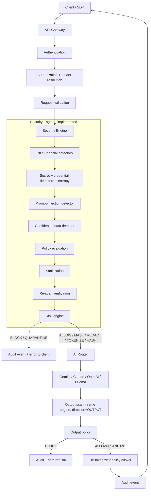
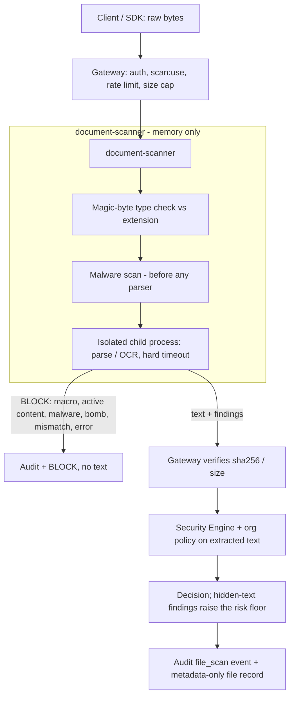

# Data Flow

## Request lifecycle

## File upload lifecycle

Every failure (scanner unreachable, timeout, parser error, OCR/AV unavailable, integrity mismatch) is a `BLOCK` with `failed_closed=true` and empty text.

## Fail-closed edges

Any of these produce `decision=BLOCK`, `failed_closed=true`, a machine-readable reason, and an audit event:

| Condition | Reason code |
|---|---|
| Input exceeds `max_input_chars` | `input_too_large` |
| A detector raises | `detector_error:<name>:<ExceptionType>` |
| Time budget exceeded between stages | `timeout` |
| No detectors registered | `no_detectors_registered` |
| Policy evaluation raises | `policy_error:<ExceptionType>` |
| Sanitized text still contains a sanitized entity type | `sanitization_verification_failed` |
| Any other exception | `internal_error:<ExceptionType>` |
| Gateway cannot reach/parse the engine (`engine_unreachable`, `engine_timeout`, `engine_http_<n>`, `engine_invalid_response`, `engine_invariant_violation`) | gateway |
| Unknown provider / policy store unreachable / audit store unwritable | `unknown_provider` / `policy_unavailable` / `audit_unavailable` (503) |
| Document scanner unreachable, times out, or replies inconsistently / with a mismatching hash | `scanner_*` (BLOCK) |
| Scanner-side: bad type, macro, active content, malware, bomb, parser crash/timeout, missing AV/OCR | reason from the scanner (BLOCK, no text) |

## What is persisted

| Data | Stored? |
|---|---|
| Prompt / response text | **No** (zero-retention default; see [privacy](../security/privacy.md)) |
| Entity types, offsets, risk, decision, policy id, detector version | Yes (audit) |
| Keyed digest of matched value | Yes, optional, for correlation only |
| Token-vault mappings | Request lifetime only, in memory / TTL cache |
| Uploaded files | **No** (memory only, never written to disk or object storage) |
| File metadata (sha256, size, detected type, verdict; never the name) | Yes, unless the org is zero-retention |
