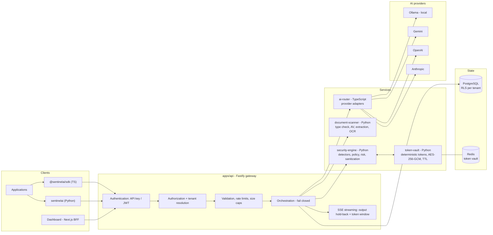
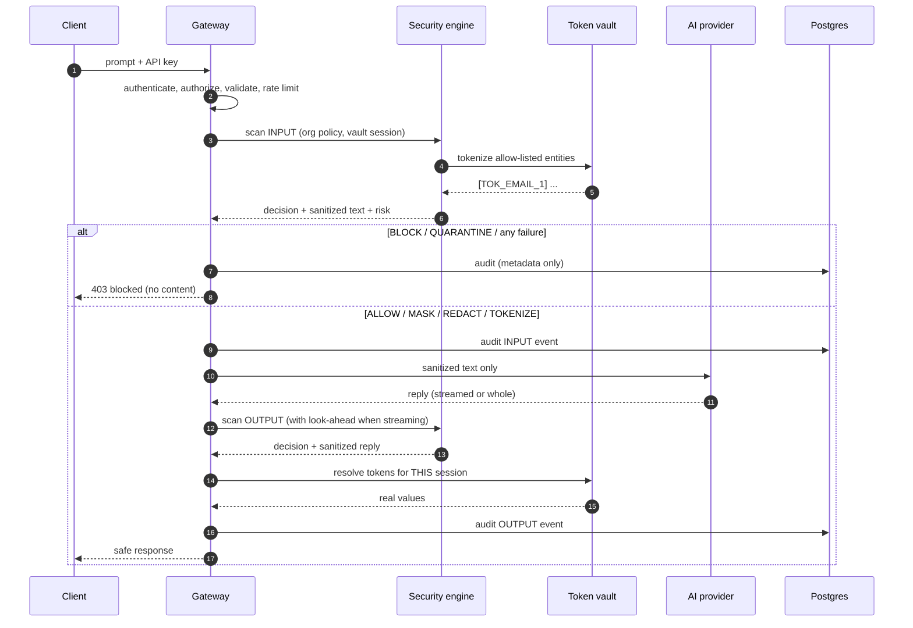
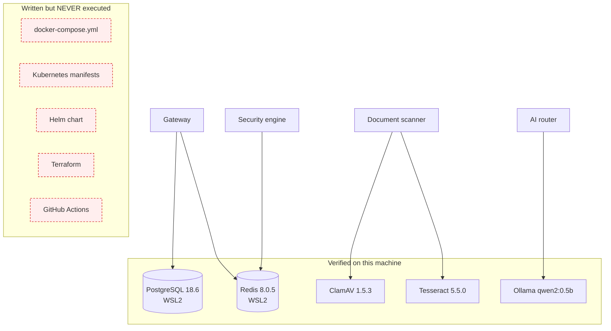

# SentinelAI v1.0 — architecture, deployment and security flow

## 1. Architecture

## 2. Security flow (one request)

Two invariants the diagram encodes: **only sanitized text ever leaves the boundary**, and **the output scan happens before
hydration**, so the scanner never sees the caller's own data and hydrated values are never re-scanned.

## 3. Deployment

Red, dashed = **blocked**: Docker is not installed on this machine, so nothing in that box has ever been built or run.
Everything in the upper box was exercised for real; see `docs/release/current-status.md` for exactly what was proven.

## 4. Where state lives

| Data | Store | Retention |
|---|---|---|
| Prompts, replies, uploaded files | **Nowhere** | Never persisted |
| Security events, audit log (types, offsets, decisions, keyed digests) | PostgreSQL | `AUDIT_RETENTION_DAYS` (default 90) |
| Token → value mappings (encrypted) | Redis | Absolute 3600 s from session creation |
| File metadata (sha256, size, type, verdict) | PostgreSQL | Skipped entirely for zero-retention organizations |
| Provider credentials | Operator environment | Not in the database in v1.0 |
