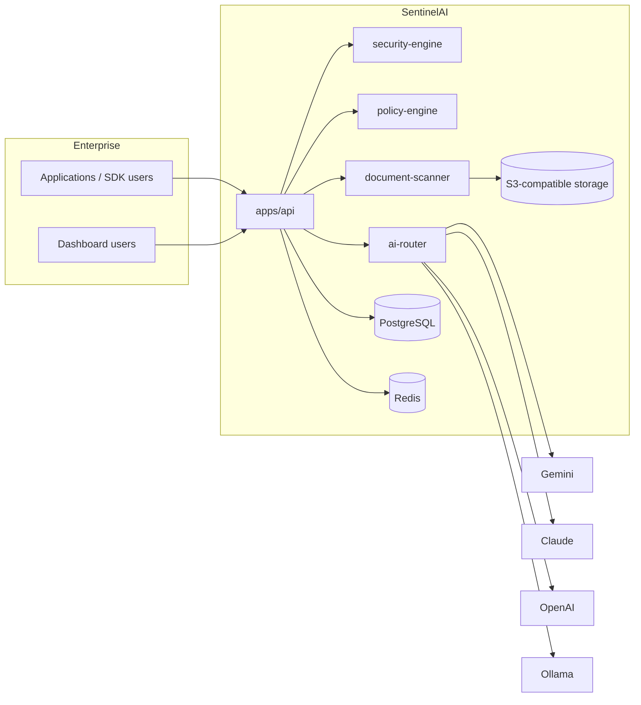
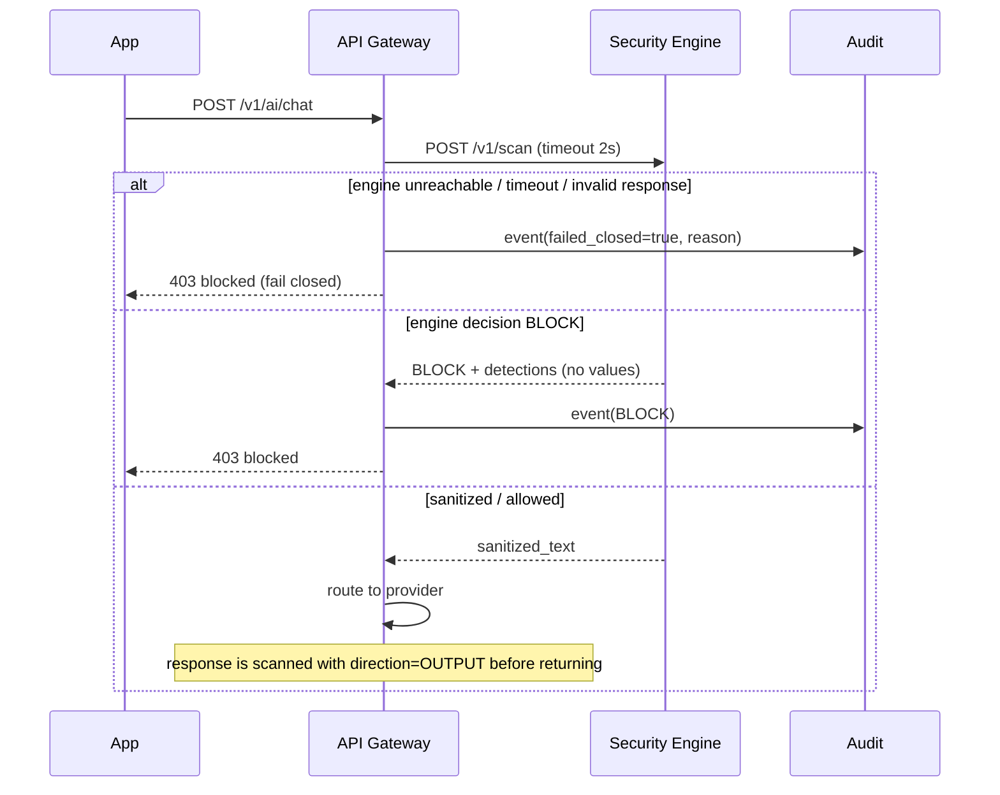
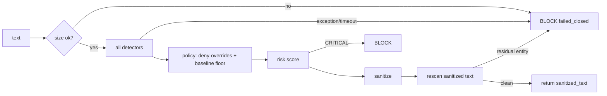

# Diagrams

## System context

```mermaid
flowchart LR
    subgraph Enterprise
      APP[Applications / SDK users]
      DASH[Dashboard users]
    end
    subgraph SentinelAI
      API[apps/api]
      SEC[security-engine]
      POL[policy-engine]
      DOC[document-scanner]
      RTR[ai-router]
      PG[(PostgreSQL)]
      RD[(Redis)]
      S3[(S3-compatible storage)]
    end
    APP --> API
    DASH --> API
    API --> SEC
    API --> POL
    API --> DOC
    API --> RTR
    API --> PG
    API --> RD
    DOC --> S3
    RTR --> GEM[Gemini]
    RTR --> CLA[Claude]
    RTR --> OAI[OpenAI]
    RTR --> OLL[Ollama]
```

## Fail-closed sequence

```mermaid
sequenceDiagram
    participant App
    participant API as API Gateway
    participant Eng as Security Engine
    participant Aud as Audit
    App->>API: POST /v1/ai/chat
    API->>Eng: POST /v1/scan (timeout 2s)
    alt engine unreachable / timeout / invalid response
      API->>Aud: event(failed_closed=true, reason)
      API-->>App: 403 blocked (fail closed)
    else engine decision BLOCK
      Eng-->>API: BLOCK + detections (no values)
      API->>Aud: event(BLOCK)
      API-->>App: 403 blocked
    else sanitized / allowed
      Eng-->>API: sanitized_text
      API->>API: route to provider
      Note over API: response is scanned with direction=OUTPUT before returning
    end
```

## Scan decision inside the engine

```mermaid
flowchart LR
    T[text] --> SZ{size ok?}
    SZ -- no --> FC[BLOCK failed_closed]
    SZ -- yes --> DET[all detectors]
    DET -- exception/timeout --> FC
    DET --> POL[policy: deny-overrides + baseline floor]
    POL --> RSK[risk score]
    RSK -- CRITICAL --> BLK[BLOCK]
    RSK --> SAN[sanitize]
    SAN --> RES[rescan sanitized text]
    RES -- residual entity --> FC
    RES -- clean --> OK[return sanitized_text]
```
