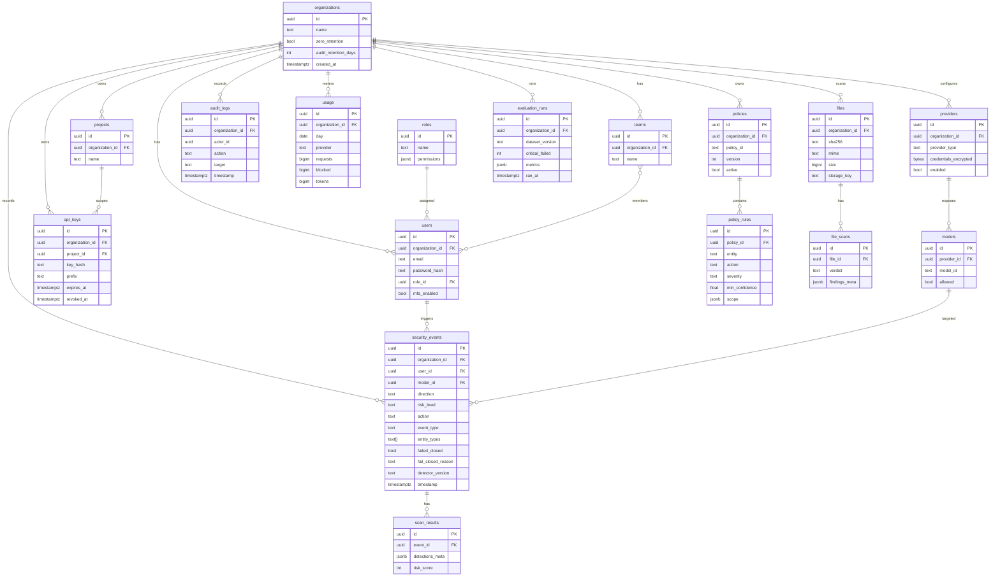

# Database ERD (PostgreSQL) - *design; migrations not yet written*

```mermaid
erDiagram
    organizations ||--o{ users : has
    organizations ||--o{ teams : has
    organizations ||--o{ api_keys : owns
    organizations ||--o{ providers : configures
    organizations ||--o{ policies : owns
    organizations ||--o{ projects : owns
    organizations ||--o{ security_events : records
    organizations ||--o{ audit_logs : records
    organizations ||--o{ usage : meters
    organizations ||--o{ files : scans
    organizations ||--o{ evaluation_runs : runs
    roles ||--o{ users : assigned
    teams }o--o{ users : members
    providers ||--o{ models : exposes
    policies ||--o{ policy_rules : contains
    projects ||--o{ api_keys : scopes
    security_events ||--o{ scan_results : has
    files ||--o{ file_scans : has
    users ||--o{ security_events : triggers
    models ||--o{ security_events : targeted

    organizations { uuid id PK  text name  bool zero_retention  int audit_retention_days  timestamptz created_at }
    users { uuid id PK  uuid organization_id FK  text email  text password_hash  uuid role_id FK  bool mfa_enabled }
    roles { uuid id PK  text name  jsonb permissions }
    teams { uuid id PK  uuid organization_id FK  text name }
    api_keys { uuid id PK  uuid organization_id FK  uuid project_id FK  text key_hash  text prefix  timestamptz expires_at  timestamptz revoked_at }
    providers { uuid id PK  uuid organization_id FK  text provider_type  bytea credentials_encrypted  bool enabled }
    models { uuid id PK  uuid provider_id FK  text model_id  bool allowed }
    policies { uuid id PK  uuid organization_id FK  text policy_id  int version  bool active }
    policy_rules { uuid id PK  uuid policy_id FK  text entity  text action  text severity  float min_confidence  jsonb scope }
    security_events { uuid id PK  uuid organization_id FK  uuid user_id FK  uuid model_id FK  text direction  text risk_level  text action  text event_type  text[] entity_types  bool failed_closed  text fail_closed_reason  text detector_version  timestamptz timestamp }
    scan_results { uuid id PK  uuid event_id FK  jsonb detections_meta  int risk_score }
    audit_logs { uuid id PK  uuid organization_id FK  uuid actor_id  text action  text target  timestamptz timestamp }
    files { uuid id PK  uuid organization_id FK  text sha256  text mime  bigint size  text storage_key }
    file_scans { uuid id PK  uuid file_id FK  text verdict  jsonb findings_meta }
    projects { uuid id PK  uuid organization_id FK  text name }
    usage { uuid id PK  uuid organization_id FK  date day  text provider  bigint requests  bigint blocked  bigint tokens }
    evaluation_runs { uuid id PK  uuid organization_id FK  text dataset_version  int critical_failed  jsonb metrics  timestamptz ran_at }
```
